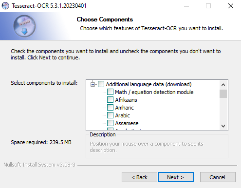

# Image to Text Extraction Guide

This guide explains how to extract text from an image using Python with the pytesseract and PIL libraries.

## Requirements

- Python
- **pytesseract** library
- **PIL** (Python Imaging Library) library
- **Tesseract OCR** software

## Installation

1. Install Python: Install Python on your computer if you haven't already.
2. Install the pytesseract and PIL libraries. You can install them using pip with the following commands:
    ```
    - pip install pytesseract
    - pip install pillow
    ```
3. Download and install Tesseract-OCR. You can download the appropriate version for your operating system from the [**Tesseract-OCR GitHub page**](https://github.com/UB-Mannheim/tesseract/wiki)
4. Do not forget to select your own language under “Additional language data (download)” in the installation package.

    

5. Set the path for Tesseract-OCR:
    ```
    import pytesseract
    pytesseract.pytesseract.tesseract_cmd = r"C:\Program Files\Tesseract-OCR\tesseract.exe" #your path may be different
    ```


## Text Extraction

1. Open the image from which you want to extract text using **Image.open()**:
    ```
    from PIL import Image
    img = Image.open('sample.png')
    ```
2. Use the **pytesseract.image_to_string()** function to extract text from the image:
    ```
    text = pytesseract.image_to_string(img, lang="tur")
    ```
    Here, use the lang parameter to specify the language code for the text you want to extract (e.g., "tur" for Turkish).

3. Print the extracted text to the screen:
    ```
    print(text)
    ```